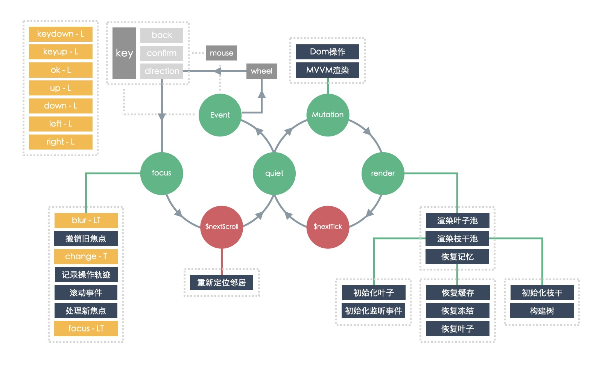

## 设计思想
> 我们希望设计的焦点框架能具备以下特性
* **业务分离**
H5项目引入本框架，无需重构，只需添加几个属性就可以在TV端正常工作。
* **不依赖框架**
基于任何框架甚至原生的H5都可以无缝接入本框架。
* **单例模式（懒汉）**
即便是SPA项目也尽量保持一个引擎对象完成所有页面的焦点事件。
## 生命周期
> 框架生命周期支持原生h5，同时也完美契合各大mvvm框架。

